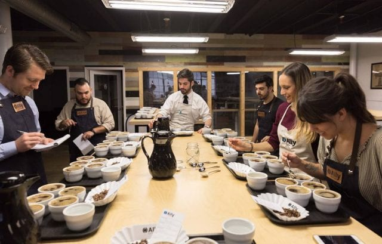

# sirisha-V

This is a coffee shop web site

#this is the html code  for the coffee shop website

#scroll down to the line 446 for the css code

<html>

<head>

<title>Drop-down Menu design</title>

<link rel="stylesheet" href="style.css">

<link rel="stylesheet" href="https://cdn.jsdelivr.net/npm/@fortawesome/fontawesome-free@6.1.2/css/fontawesome.min.css">

<meta name="viewport" content="width =device-width, initial-scale=1">

<link href="https://fonts.google.com/css?family=kaushan*Script|poppins&display=swap" rel="stylesheet">

<link rel="stylesheet" href="https://cdnjs.cloudflare.com/ajax/libs/font-awesome/4.7.0/css/font-awesome.min.css">

</head>

<body>

<section id="banner">

	<image src="house.png" class="logo">

	

		<h1>Coffee Shop</h1>

		
"Make some coffee and own the day"

		

			<a href="#footer">Find Out</a>

			<a href="#features">Read More</a>

		

	

</section>

	<nav>

	<ul>
		
		<li><a href="#banner">Home</a></li>
		
		<li><a href="#features">Features</a></li>
		
		<li><a href="#service">Services</a></li>
		
		<li><a href="#testimonial">Testimonials</a></li>
		
		<li><a href="#footer">Meet Us</a></li>
	
	</ul>
	
	</nav>

	

<!--Features-->

<section id="features">

Features

<h1>Why Our Coffee Shop</h1>

	

		<h1>Rich Coffee Beans</h1>

		

			

				<i class="fa fa-leaf"></i>

			

			

				
Richness is characterized by a coffee that is “full” in flavor, body, or acidity. People 
				often only think to use “rich” to describe a bold or intense flavor characteristic associated 
				with darker roasts, but in reality, a light roast with high acidity and or body can also be rich.

				

			
			

		
		

		
		<h1>Flavour Of The Coffee</h1>
		
		

		
			

		
				<i class="fa fa-coffee"></i>
		
			

		
			

		
				
Coffee aroma descriptors include flowery, nutty, smoky, and herby, while taste descriptors 
				include acidity, bitterness, sweetness, saltiness and sourness.

			
			

		

		
	<h1>Affordable Price</h1>
	
		

	
			

	
				<i class="fa fa-inr"></i>
	
			

	
			

	
				
Our coffee is affordable for all the commom people.

	
			

	
		

	
	

	
	

	
		
	
	

</section>

<!--service-->

<section id="service">

	

	
Services

	<h1>Taking Care of Our Customers</h1>

	

	

		

			

			

			

				<h3>Great serving</h3>

				

				
No matter the kind of business we run, we strongly believe that it is essential to our customers to pay the utmost attention to the customer service aspect.

			

		

		

			

			

			

				<h3>Provide Targeted Training To Our Staff</h3>

				

				
Our staff to make a kickin’ espresso with giving them the proper ingredients and equipment. 
				You can expect them to provide premium customer service with the proper set of skills. 

			
			

		

		

			

			

			

				<h3>Encourages Active Communication</h3>

				

				
Customer service is not just about replying to clients’ questions and handing out free vouchers. It is about forming a connection with the customers to ensure a positive and long-lasting business relationship. At the same time, it also pertains to doing the same for the people working for our business establishment. 

			

		

		

			

			

			

				<h3>Be Open to Feedback</h3>

				

				
A big aspect of customer service is to actually stop and listen to what our customers have to tell you. It doesn’t always have to be a complaint for us to seriously heed to it. Most of the time, it is what our customers are telling us in subtle feedback that needs to be paid attention to at all costs. 

			

		

	

</section>

<!--Teatimonials-->

<section id="testimonial">

	

	
TESTIMONIALS

	<h1>What our customers says!!!</h1>

	

	

		

			

				

				

					<h4>Carley <i class="fa fa-user"></i></h4>

					<small>@carley_k</small>

				

			

			
I really like the atmosphere, good coffee, and nice interior. This is a good place to study or chill with friends. The drinks and foods were all tasty and worthwhile. If you’re up for a fresh place with beautiful architecture then this is a must to visit.

		

		

			

				

				

					<h4>Richard<i class="fa fa-user"></i></h4>

					<small>@richar_rich</small>

				

			

			
 I would probably say that this coffee shop is a must for coffee lovers! The service was good, and the variety of coffee served in the ambiance was very satisfying. If you like your coffee shops, then this is a must-visit! I will be back again!

		

		

			

				

				

					<h4>Amily<i class="fa fa-user"></i></h4>

					<small>@amily_johnson</small>

				

			

			
. This place is very different and well organized according to other places. The coffee is amazing, music of your choice. The owner is very sweet… Ever the best café. The cost is fair for everything and the atmosphere is good.

		

	

</section>

<!--footer-->

<section id="footer">

	

	

	
Contact

	<h1>Visit Our Shop</h1>

	

	

		<h1>Opening hours</h1>

		
<i class="fas fa-clock"></i>Moday to Saturday- 24/7

		
<i class="far fa-clock"></i>Moday to Sunday - 9am to 6pm

	

	

		<h1>Get in Touch</h1>

		
30 abc colony, X street, Hyderabad, Telengana, India <i class="fa fa-map-marker"></i>

		
email-id:coffeeshop@gmail.com<i class="fa fa-paper-plane"></i>

		
Phoneno:1234567890<i class="fa fa-phone"></i>

	

	  

	  

	  

	  

	  

	
Thanks visiting our coffee shop Visit our coffee shop again...

</section>

</body>

</html>

           #this is the css code for the coffee shop website

*

{

	padding: 0;

	margin: 0;

	font-family: 'poppins', sans-serif;

}

#banner

{

	background-image: linear-gradient(rgba(0, 0, 0, 0.5),#C4A48454),url(back.jpg);

	background-size: cover;

	background-position: center;

	font-family: sans-serif;

	height: 100vh;

}

.logo{

	width: 140px;

	position: absolute;

	top: 4%;

	left: 10%;

}

.banner-text{

	text-align: center;

	color: #fff;

	padding-top: 180px;

}

.banner-text h1{

	font-size: 130px;

	font-family: 'Kaushan Script',cursive;

}

.banner-text p{

	font-size: 20px;

	font-style: italic;

}

.banner-btn{

	margin: 70px auto 0;

}

.banner-btn a{

	width: 150px;

	text-decoration: none;

	display: inline-block;

	margin: 0 10px;

	padding: 12px 0;

	color: #fff;

	border: .5px solid #fff;

	position: relative;

	z-index: 1;

	transition: color 0.5s;

}

.banner-btn a span{

	width: 0;

	height: 100%;

	position: absolute;

	top: 0;

	left: 0;

	background: #fff;

	z-index: -1;

	transition: 0.5s;

}

.banner-btn a:hover span{

	width: 100%;

}

.banner-btn a:hover{

	color: #000;

}

#sideNav{

	width: 250px;

	height: 100vh;

	position: fixed;

	right: -250px;

	top: 0;

	background: #C4A48452;

	z-index: 2;

	transition: 0.5s;

}

nav ul li{

	list-style: none;

	margin: 50px 20px;

}

nav ul li a {

	text-decoration: none;

	color: #fff;

}

#menuBtn{

	width: 50px;

	height: 50px;

	background: #C4A48452;

	position: fixed;

	right: 30px;

	top: 20px;

	border-radius: 3px;

	z-index: 3;

	cursor: pointer;

}

#menuBtn img{

	width: 50px;

	margin-top: 0px;

}

@media screen and(max-width: 770px){

	.banner-text h1{

	font-size: 44px;

	}

.banner-btn a{

	display: block;

	margin: 20px auto;

	}

}

/*--feature--*/

#features{

	width: 100%;

	padding: 70px 0;

}

.title-text{

	text-align: center;

	padding-bottom: 70px;

}

.title-text p{

	margin: auto;

	font-size: 20px;

	color:  #7B3F00;

	position: relative;

	z-index: 1;

	display: inline-block;

}

.title-text p::after{

	content: '';

	width: 50px;

	height: 35px;

	background: linear-gradient(#C4A484 ,#fff);

	position: absolute;

	top: -20px;

	left: 0;

	z-index: -1;

	transform: rotate(10deg);

	border-top-left-radius: 35px;

	border-bottom-right-radius: 35px;

}

.title-text h1{

	font-size: 50px;

}
.feature-box{

	width: 80%;

	margin: auto;

	display: flex;

	flex-wrap: wrap;

	align-items: center;

	text-align: center;

}

.features{

	flex-basis: 50%;
}

.features-img{

	flex-basis: 50%;

	margin: auto;

}

.features-img img{

	width: 70%;

	border-radius: 10px;

}

.features h1{

	text-align: left;

	margin-bottom: 10px;

	font-weight: 100;

	color: #000;

}

.features-desc{

	display: flex;

	align-items: center;

	margin-bottom: 40px;

}

.feature-icon .fa{

	width: 50px;

	height: 50px;

	font-size: 30px;

	line-height: 50px;

	border-radius: 8px;

	color: #000;

	border: 1px solid #000;

}

.feature-text p{

	padding: 0 20px;

	text-align: initial;

}

@media screen and(max-width: 770px){

	.title-text h1{

		font-size: 35px;

	}

	.features{

	flex-basis: 100%;

	}

	.features-img{

	flex-basis: 100%;

	}	

	.features-img img{

	width: 100%;

	}

}

/*--service---*/

#service{

	width: 100%;

	padding: 70px 0;

	background: #efefef;

}

.service-box{

	width: 80%;

	display: flex;

	flex-wrap: wrap;

	justify-content: space-around;

	margin: auto;

}

.single-service{

	flex-basis: 48%;

	text-align: center;

	border-radius: 7px;

	margin-bottom: 20px;

	color: #fff;

	position: relative;

}

.single-service img{

	width: 100%;

	border-radius: 7px;

}

.overlay{

	width: 100%;

	height: 100%;

	position: absolute;

	top: 0;

	border-radius: 7px;

	cursor: pointer;

	background: linear-gradient(rgba(0, 0, 0, 0.5),#C4A484);

	opacity: 0;

	transition: 1s;

}

.single-service:hover .overlay{

	opacity: 1;

}

.service-desc{

	width: 80%;

	position: absolute;

	bottom: 0;

	left: 50%;

	opacity: 0;

	transform: translateX(-50%);

	transition: 1s;

}

hr{

	background: #fff;

	height: 2px;

	border-radius: 0;

	margin: 15px auto;

	width: 60%;

}

.service-desc p{

	font-size: 14px;

}

.single-service:hover .service-desc{

	bottom: 40%;

	opacity: 1;

}
@media screen and(max-width: 770px){

	.single-service{

		flex-basis: 100%;

		margin-bottom: 30px;
	}

	.service-desc p{

		font-size: 12px;

	}

	hr{

		margin: 5px auto;

	}

}

.single-service:hover .overlay{

	bottom: 25% !important;

}

/*--testimonials--*/

.testimonial{

	width: 100%;

	padding: 70px 0;

}

.testimonial-row{

	width: 80%;

	margin: auto;

	display: flex;

	justify-content: space-between;

	align-items: flex-start;

	flex-wrap: wrap;

}

.testimonial-col{

	flex-basis: 28%;

	padding: 10px;

	margin-bottom: 30px;

	border-radius: 5px;

	box-shadow: 0 10px 20px 3px #00968814;

	cursor: pointer;

	transition: transform .5s;

}

.testimonial-col p{

	font-size: 14px;

}

.user{

	display: flex;

	align-items: center;

	margin: 20px 0;

}

.user img{

	width: 40px;

	margin-right:20px ;

	border-radius: 3px;

}

.user-info .fa{

	margin-left: 10px;

	color: #27c0ff;

	font-size: 20px;

}

.user-info small{

	color: #009688;

}

.testimonial-col:hover{

	transform: translateY(-7px);

}

.@media screen and(max-width: 770px){

	.testimonial-col{

		flex-basis: 100%;

	}

}

/*--footer--*/

#footer{

	padding: 100px 0 20px;

	background: #efefef;

	position: relative;

}

.footer-row{

	width: 80%;

	margin: 0 auto;

	display: flex;

	justify-content: space-between;

	flex-wrap: wrap;

}

.footer-left, .footer-right{

	flex-basis: 45%;

	padding: 10px;

	margin-bottom: 20px;

}

.footer-right{

	text-align: right;

}

.footer-row h1{

	margin: 10px 0;

}

.footer-row p{

	line-height: 35px;

}

.footer-left .fa, .footer-right .fa{

	font-size: 20px;

	color: #000;

	margin: 10px;

}

.footer-img{

	max-width: 370px;

	opacity: 0.1;

	position: absolute;

	left: 50%;

	top: 35%;

	transform: translate(-50%,-50%);

}
.social-links{

	text-align: center;

}

.social-links .fa-brands{

	height: 40px;

	width: 40px;

	font-size: 20px;

	line-height: 40px;

	border: 1px solid #000;

	margin: 40px 5px 0;

	color: #009688;

	cursor: pointer;

	transition: .5s;

}

.social-links .fa-brands: hover{

	transform: translateY(-7px);

	opacity: 1;

}

.social-links .fa {  

  padding: 20px;  

text-align: center;  

  margin: 5px 2px;  

  font-size: 30px;  

  width: 50px; 

}  

.fa-facebook {  

  background: #3B5998;  

  color: white;  

}  

.fa-twitter {  

  background: #55ACEE;  

  color: white;  

}

.fa-instagram {  

  background: #125688;  

  color: white;  

}  

.fa-youtube {  

  background: #bb0000;  

  color: white;  

}  

.fa-google {  

  background: #dd4b39;  

  color: white;  

}  

.fa:hover {  

    opacity: 0.9;  

}  

.social-links p{

	font-size: 12px;

	margin-top: 20px;

}

@media screen and(max-width: 770px){

	.footer-left, .footer-right{

		flex-basis: 100%;

		font-size: 14px;

	}

	.footer-img{

		top: 25%;

	}
}
